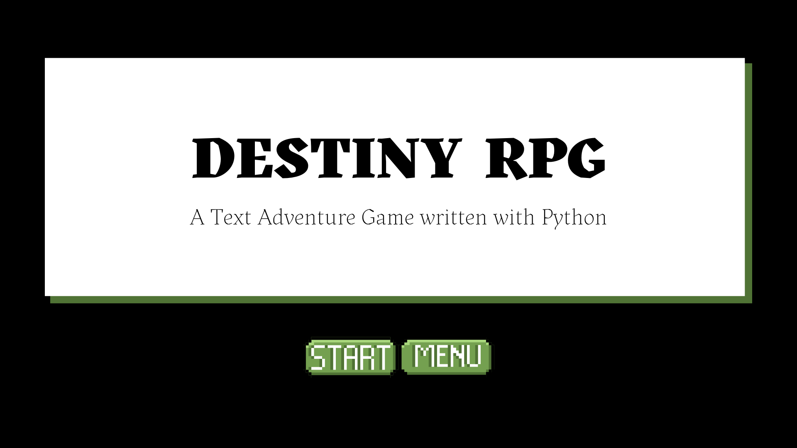
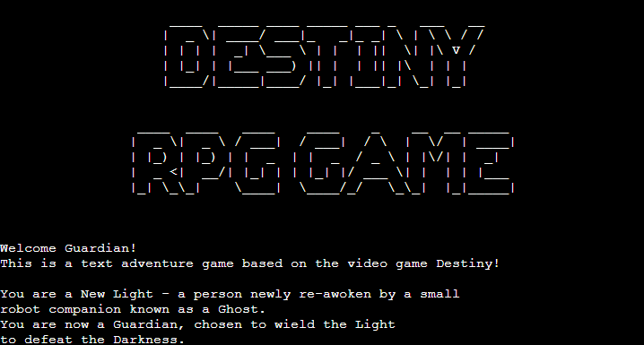

# Destiny Text Adventure Game

Welcome to a Destiny Text Adventure Game! This game is built purely using Python. It's designed to be a fun "Choose your own adventure" game, with random luck elements and items. Based on the very popular game Destiny and Destiny 2, this text adventure will bring you through the first mission in the game, from waking on the Cosmodrome to getting you ship's engine to fly to the Tower. If you get a high luck score and you choose the correct path, you'll make it out alive!

[Live link to The Destiny Text Adventure Gamecl](https://destiny-rpg.herokuapp.com/)

 

# Table of Contents

1. [Features](#features)
    * [Game Start](#game-start)
2. [User Experience (UX)](#user-experience-ux)
    * [Site Goals](#site-goals)
    * [User Stories](#user-stories)
    * [Design](#design)
3. [Technologies](#technologies)
    * [Languages Used](#languages-used)
    * [Libraries And Frameworks](#libraries-and-frameworks)
    * [Tools and Resources](#tools-and-resources)
4. [Testing](#testing)
    * 
5. [Bugs Found and Fixed](#bugs-found-and-fixed)
    * [Bugs Not Fixed](#bugs-not-fixed)
6. [Credits And Sources](#credits-and-sources)
7. [Deployment](#deployment)
8. [Acknowledgements](#acknowledgements)

# Features 

## Existing Features

### Game Start

- The first thing to load is a logo for the game, created with the [Pyfiglet Library](https://pypi.org/project/pyfiglet/). This is a large Ascii text image, saying "Destiny RPG Game".
- Along with this is a small paragraph explaining the game and the story for any users that have no prior knowledge of the Destiny games.

### Classes and Subclasses
- The player will be asked to enter their name first and then they are given a choice of which Destiny Class they would like to be, as well as their subclass. These choices are then stored in a Google Sheets Worksheet, allowing this data to be pulled later on in the game to reference the player.
- Depending on their choices here, the game will later on pick a grenade ability of the element selected in a fight scene. 

 

[Back to Top](#table-of-contents)

 

## Features Left to Implement

- 

 

[Back to Top](#table-of-contents)

 

# User Experience (UX)

## Site Goals

## User Stories

* Users will:

  * 

 

## Design

### Wireframe
 - 

 

[Back to Top](#table-of-contents)

 

# Technologies

## Languages Used
* 

## Libraries And Frameworks
* 
## Tools And Resources
* [GitPod](https://www.gitpod.io/)
* [GitHub](https://github.com/)
* [ReadMe Template](https://github.com/Code-Institute-Solutions/readme-template)
* [Balsamiq](https://balsamiq.com/)
* [Stack Overflow](https://stackoverflow.com/)

 

[Back to Top](#table-of-contents)

 

# Testing 
### Validator Testing 

- 
  

### Other Testing
 - 

  

[Back to Top](#table-of-contents)

 

# Bugs Found and Fixed
 - 
 

# Bugs Not Fixed
 - 

 

[Back to Top](#table-of-contents)

 

# Credits and Sources

- 
 

[Back to Top](#table-of-contents)

 

# Deployment

The following are the steps I went through to deploy my live site:

- The site was deployed using Heroku. The steps to deploy are as follows: 
  - 

- To Fork the repository:
  - On GitHub.com, navigate to the repository.
  - In the top-right corner of the page, click Fork.
  - Select an owner for the forked repository.
  - By default, forks are named the same as their parent repositories. You can change the name of the fork to distinguish it further.
  - Optionally, add a description of your fork.
  - Choose whether to copy only the default branch or all branches to the new fork.
  - Click Create fork.

- To Clone the repository:
  - On GitHub.com, navigate to the repository.
  - Above the list of files, click the Code button.
  - Copy the URL for the repository.
  - Open Git Bash.
  - Change the current working directory to the location where you want the cloned directory.
  - Type git clone, and then paste the URL you copied earlier.
  - Press Enter. Your local clone will be created.

 
The live link can be found here - 

 

[Back to Top](#table-of-contents)

 

# Acknowledgements
- To my amazing boyfriend Thomas. For listening to me worry about this project for months, for keeping me sane, for helping me switch off after a long day with a cup of coffee and a bar of chocolate :)
- My family and my cats for keeping my stress levels under control!
- My Mentor [Jubril Akolade](https://github.com/Jubrillionaire) for all the help. His guidance was invaluable.
- Sean Finn and Sean Johnston, my fellow classmates on Slack. Your help with my many questions was super appreciated, thank you.

 

[Back to Top](#table-of-contents)