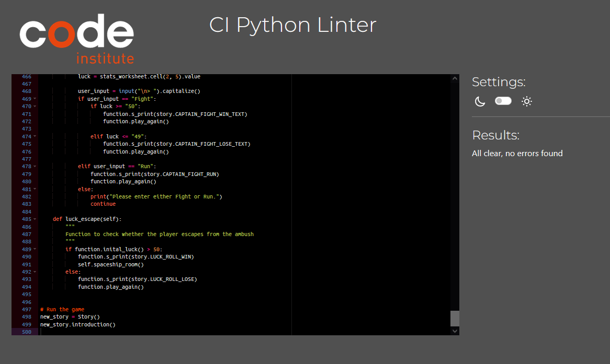

# Destiny Text Adventure Game

Welcome to a Destiny Text Adventure Game! This game is built purely using Python. It's designed to be a fun "Choose your own adventure" game, with random luck elements and items. Based on the very popular games [Destiny and Destiny 2](https://www.bungie.net/), this text adventure will bring you through the first mission in the game, from waking on the Cosmodrome to getting you ship's engine to fly to the Tower. If you get a high luck score and you choose the correct path, you'll make it out alive!

[Live link to The Destiny Text Adventure Gamecl](https://destiny-rpg.herokuapp.com/)

 

# Table of Contents

1. [Features](#features)
    * [Game Start](#game-start)
    * [Class and Subclasses](#classes-and-subclasses)
    * [Random Luck and Encounters](#random-luck-and-encounters)
    * [Inventory](#inventory)
    * [Play Again](#play-again)
    * [Future Features](#play-again)
2. [Project Goals](#project-goals)
3. [User Stories](#user-stories)
4. [Design](#design)
5. [Technologies](#technologies)
    * [Languages Used](#languages-used)
    * [Libraries And Frameworks](#libraries-and-frameworks)
    * [Tools and Resources](#tools-and-resources)
6. [Testing](#testing)
    * 
7. [Bugs Found and Fixed](#bugs-found-and-fixed)
    * [Bugs Not Fixed](#bugs-not-fixed)
8. [Credits And Sources](#credits-and-sources)
9. [Deployment](#deployment)
10. [Acknowledgements](#acknowledgements)

# Features 

## Existing Features

### Game Start

- The first thing to load is a logo for the game, created with the [Pyfiglet Library](https://pypi.org/project/pyfiglet/). This is a large Ascii text image, saying "Destiny RPG Game".
- Along with this is a small paragraph explaining the game and the story for any users that have no prior knowledge of the Destiny games.

### Classes and Subclasses
- The player will be asked to enter their name first and then they are given a choice of which Destiny Class they would like to be, as well as their subclass. These choices are then stored in a Google Sheets Worksheet, allowing this data to be pulled later on in the game to reference the player.
- Depending on their choices here, the game will later on pick a grenade ability of the element selected in a fight scene. 

### Random Luck and Encounters
- When the game first loads, players will be given a random luck number between 1-100. This is chosen using the randint Method. This will effect the end game for the player as well as in certain fights.
- A random encounter can occur for the player. In certain rooms, an encounter will roll to either True or False. If this is True, the encounter with a Vandal will run and players will lose a certain amount of health, again chosen by the randint Method. 

### Inventory
- For their first choice, players can search some cars in front of them. If they're lucky, the can find a key, which will allow them to open a chest within the story. This chest has a chance of dropping a weapon, which will give them a greater advantage of winning the game.
- This item is stored in the Google Sheets Worksheet, allowing the name to be recalled later in the story.
- After all stats are added, the Player Stats sheet will look like this:

### Play Again
- At the end of the game or if the player dies, they have the option of playing again. This will trigger code to reset the workseet stats, reset the console and run the story from the beginning.

 

[Back to Top](#table-of-contents)

 

## Future Features

- I'd love to add either some animation or colour, if possible. I feel this would make the game more appealing to play, especially to younger generations who haven't played Text Adventure games before.
- The story and encounters could be fleshed out more, with different scenarios, more of an inventory and more randomness.
- Each subclass also has a unique "Super ability" in the actual Destiny games. I thought of implementing this but felt I would have more repetitive code. When I learn more Python, it would be fun to add this in without repeating myself.

 

[Back to Top](#table-of-contents)

 

## Project Goals

* I wanted to create an old school Choose Your Own Adventure type game but with the Destiny theme. As a kid, I played my fair share of text based Adventure games and the appeal of them has never left me. Bringing a new game into an old game was an idea I was very fond of.

* As a purely python game, I knew something that had multiple choices, as well as an inventory system, was going to be challenging to me for this project.

 

[Back to Top](#table-of-contents)

 

## User Stories

* Users will:

  * Play a Text Based Adventure Game with a story from Destiny The Game.
  * Have a different game experience every time they play, with random weapons, encounters and luck.
  * Be able to restart the game without needing to refresh or reload the link.

* Users expect:

  * A fun to play text adventure game in an old school style.
  * A Destiny themed game, with enemies, classes and weapons they recognize.
  * Replayability.
  * A fast paced game, playing through the first Destiny story mission.

 

[Back to Top](#table-of-contents)

 

## Design

- My starting point on this project was designing a flow chart based on the first story mission in Destiny The Game. To make the text adventure more fun, I added the random encounters and ability to choose ways to go and luck based weapons.

 

[Back to Top](#table-of-contents)

 

# Technologies

## Languages Used
* [Python](https://www.python.org/)

## Libraries And Frameworks
* [Google Sheets](https://www.google.com/sheets/about/)
* [gspread](https://docs.gspread.org/en/v5.7.0/)
* [Pyfiglet](https://pypi.org/project/pyfiglet/)
* [os](https://docs.python.org/3/library/os.html#os.system)
* [random](https://docs.python.org/3/library/random.html)
* [time](https://docs.python.org/3/library/time.html)

## Tools And Resources
* [GitPod](https://www.gitpod.io/)
* [GitHub](https://github.com/)
* [Heroku](https://heroku.com)
* [ReadMe Template](https://github.com/Code-Institute-Solutions/readme-template)
* [Lucid Chart](https://www.lucidchart.com/)
* [Stack Overflow](https://stackoverflow.com/)
* [Canva](https://www.canva.com/) for my README image.

 

[Back to Top](#table-of-contents)

 

# Testing 
### Validator Testing 

* All code passed through the CI Python Linter with no issues or warnings

  

### Other Testing
 - For a list of all manual testing done, please follow this link.

  

[Back to Top](#table-of-contents)

 

# Bugs Found and Fixed
 - 
 

# Bugs Not Fixed
 - 

 

[Back to Top](#table-of-contents)

 

# Credits and Sources

- 
 

[Back to Top](#table-of-contents)

 

# Deployment

The following are the steps I went through to deploy my live site:

- The site was deployed using Heroku. The steps to deploy are as follows: 
1. Go to [Heroku](https://dashboard.heroku.com/apps)
2. Go to 'New' and select 'Create a new app'
3. Input your app name and create app.
4. Navigate to 'Settings'
5. Install the needed buildpacks. Select Python and install and then node.js and install and then click save. They must be in this order.
6. Navigate to the 'Deploy' section. 
7. Connect to GitHub, search for your repo and confirm. 
8. Choose branch to deploy.
9. Your app should now be available to see. You can choose whether to have your app automatically redeploy with every push or to keep it manual. 

- To Fork the repository:
  - On GitHub.com, navigate to the repository.
  - In the top-right corner of the page, click Fork.
  - Select an owner for the forked repository.
  - By default, forks are named the same as their parent repositories. You can change the name of the fork to distinguish it further.
  - Optionally, add a description of your fork.
  - Choose whether to copy only the default branch or all branches to the new fork.
  - Click Create fork.

- To Clone the repository:
  - On GitHub.com, navigate to the repository.
  - Above the list of files, click the Code button.
  - Copy the URL for the repository.
  - Open Git Bash.
  - Change the current working directory to the location where you want the cloned directory.
  - Type git clone, and then paste the URL you copied earlier.
  - Press Enter. Your local clone will be created.

 
The live link can be found here - 

 

[Back to Top](#table-of-contents)

 

# Acknowledgements
- To my amazing boyfriend Thomas. For listening to me worry about this project for months, for keeping me sane, for helping me switch off after a long day with a cup of coffee and a bar of chocolate :)
- My family and my cats for keeping my stress levels under control!
- My Mentor [Jubril Akolade](https://github.com/Jubrillionaire) for all the help. His guidance was invaluable.
- Sean Finn and Sean Johnston, my fellow classmates on Slack. Your help with my many questions was super appreciated, thank you.

 

[Back to Top](#table-of-contents)