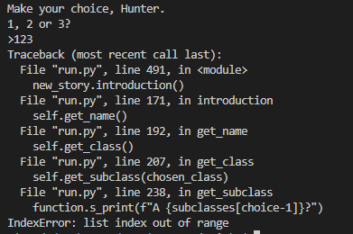

## Manual Testing

This table is all the manual testing done for each function, if it worked as expected or not.

 ### Features

Feature Tested | Expected Result | Actual Result | Pass/Fail
---------------|-----------------|---------------|----------
Press 'enter' on intro screen | The first story text should run | As expected | Pass
Type a name into terminal when prompted | Receive message "It's nice to meet you, {name}." | As expected | Pass
Pick a class from the options | Receive message "Welcome, {chosen_class}." | As expected | Pass
Pick a subclass from the options | Receive message "A {subclasses[choice-1]}?" | As expected | Pass
Player class, subclass and luck are uploaded to spreadsheet | Should be visible on spreadsheet | As expected | Pass
Chooses story option 1 to search cars | Function to search cars runs | As expected | Pass
Chooses story option 2 to enter building | Function to enter building runs | As expected | Pass
Chooses story option 3 to exit game | Message "You run towards the cliff and jump! This is all too much to take.[END]" prints | As expected | Pass
Searching the cars either finds a key or not | Receive message "You've found a key!" or "But you didn't find anything" | As expected | Pass
Function runs automatically to enter the building | Building story text will print | As expected | Pass
Pick yes to open the chest with key in inventory | Message "You've used your key" received | As expected | Pass
Pick yes to open the chest without key in inventory | Message "You don't have a key and the lock won't budge." | As expected | Pass
Pick no to open the chest | Message "The chest looks old and worn..." | As expected | Pass
If chest is opened, random roll for a weapon | Message "You've found a {weapon}!, spreadsheet updated | As expected | Pass
If chest is opened, random roll for a weapon | Message "There was nothing in the chest, only dust..." | As expected | Pass
Building hallway function runs | Story text to choose a path runs | As expected | Pass
Player chooses room 1 | Dreg attacks player for random health amount | As expected | Pass
Player chooses room 1 | Player character attacks back with no weapon, text to show "You're a {player_class}. A {player_subclass}. You can use your {player_ability}." | As expected | Pass
Player chooses room 1 | Player character attacks back with a weapon, text to show "You pull out your {stored_weapon}" | As expected | Pass
Hallway choice function automatically runs | Story text for Hallway choices runs and shows player options | As expected | Pass
Player chooses room 2 in Hallway | Empty room text prints, player is given the other 2 options for the Hallway | As expected | Pass
Random Vandal attack occurs | Message "Out of nowhere, a Fallen Vandal attacks you!", player loses a random amount of health. | As expected | Pass
Player chooses left from hallway options | SpaceShip function story prints | As expected | Pass
Player chooses right from hallway options | LuckEscape function text prints | As expected | Pass
Player has high luck number | Message "You manage to hide behind some nearby crates" prints | As expected | Pass
Player has low luck number | Message "Oh no, a Fallen Servitor!" prints, game ends | As expected | Pass
Player chooses back from hallway options | Game Ends | As expected | Pass
Spaceship room function with high luck roll | Message "you aim at the Captain and hit him with the full force of your Super." prints | As expected | Pass
Spaceship room function with low luck roll | Message "You wield the Light, you aim at the Captain But you miss" prints | As expected | Pass
Player is asked if they want to play again | Message "Would you like to play again?" prints | As expected | Pass
Player is asked if they want to be resurrected | Message "Please enter yes or no" prints | As expected | Pass

### Errors

Error Tested | Expected Result | Actual Result | Pass/Fail
-------------|-----------------|---------------|----------
Press something before 'enter' on intro screen | Receive message "You typed '{start}'. When you're ready to begin. press ENTER." and should remain on Introduction screen | As expected | Pass
Player enters something other than letters when asked for name | Receive message "Please enter letters only." | As expected | Pass
Type less than 3 characters when asked for name | Receive message "Please enter a name at least 3 letters long." | As expected | Pass
Player enters anything other than the 3 possible Classes | Receive message "Please type one of the classes listed." | As expected | Pass
Player enters anything other than the numbers 1, 2 or 3 when option arises | Receive message "Please enter number 1, 2 or 3." | As expected | Pass
Search function runs, awards a key to player inventory if True | Player inventory is updated or not, player receives message to inform them | As expected | Pass
Player types anything other than Yes or No when question arises | Receive message "Please enter yes or no" | As expected | Pass
Player receives a weapon | Receive message "You've found a {weapon}!" | As expected | Pass
Players don't enter either Fight or Run during Captain fight | Receive message "Please enter Yes or No." | As expected | Pass
Players don't enter either Yes or No when asked to be resurrected | Receive message "Please enter either fight or run." | As expected | Pass

## Fixed bugs

 Below is a description of fixed bugs from unit test fails.

 ### get_name()

  - #### Reason for fail:

    - User could input a name that was 1 or 2 characters long.

  - #### Fix:

    - Add len(name.strip(" ")) to the function - user now needs to input a username 3 characters or longer.

  ### get_subclass()

  - #### Reason for fail:

    - Players need to enter a number - either 1, 2 or 3. However if they enter any other number, an error occurs "IndexError: list index out of range"

  - #### Fix:

    - I originally tried to use a range() for the input but I struggled with making this work because of the input containing an f-string. Upon further research, I realised I could add an if statement to my Try, to make sure the user input either 1, 2 or 3.

 

   

  - #### Reason for fail:

    - Entering a string in the Subclass input was giving the error "invalid lteral for int() with base 10"

  - #### Fix:

    - Researching this took me a long time. As I was enumerating the list for Subclass choices with an index (that starts at 0), I needed the input to be an int. I asked for help on both Reddit.com/LearnPython and StackOverflow and eventually figured out that with a Try statement, I could add a ValueError and an if statement to make sure the player entered a number between 1 and 3 and it wasn't a string.

  - #### Reason for fail:

    - When calling get_subclass, it was choosing the last game's choice, instead of the current one. 

  - #### Fix:

    - To fix, I passed the chosen_class parameter to get_subclass:
        - if player_class == "Hunter":
        - if chosen_class == "Hunter":

   

  ### Else statements

  - #### Reason for fail:

    - If a player entered a choice that wasn't listed for certain options, the error message would print to the terminal however, instead of repeating the choices, the game would then print a different functions questions.

  - #### Fix:

    - For this, I realised I needed to add the word "continue" within my Else statement. This made the code loop again if an incorrect option was entered.

   

   

  ### Player Health not clearing each run

  - #### Reason for fail:

    - Everytime the health function would run, it would choose a randint between 1 and 100. This would be removed from the players starting health of 100. However, if a player chose to re-run the game, the players health would stay as the negative number. This meant the player would always die at the Dreg Fight function.

  - #### Fix:

    - Add the code "guardian.health = 100" to the play_again function. This would reset it every time.

 

 ### dreg_fight() function not calling the correct values

  - #### Reason for fail:
  
    - The dreg_fight function was not calling the correct values.
    
  - #### Fix:
  
    - I had originally put the parameters in the function for the returned values of (chosen_class, chosen_subclass, abilities, weapon), however I realised that because of the different classes I have, this wasn't working. To fix it, I wrote local variables to pull the values from the spreadsheet instead.

 

 ### Error Code 400 on gspread

  - #### Reason for fail:
  
    - When running the player_abilites function, I would get an error saying "gspread.exceptions.APIError: {'code': 400,..."
    
  - #### Fix:
  
    - Researching lead to me to understand that I had my possible abilites in a [list] and the google spreadsheet couldn't understand that. Removing them from a list and putting them in a Tuple fixed this error.